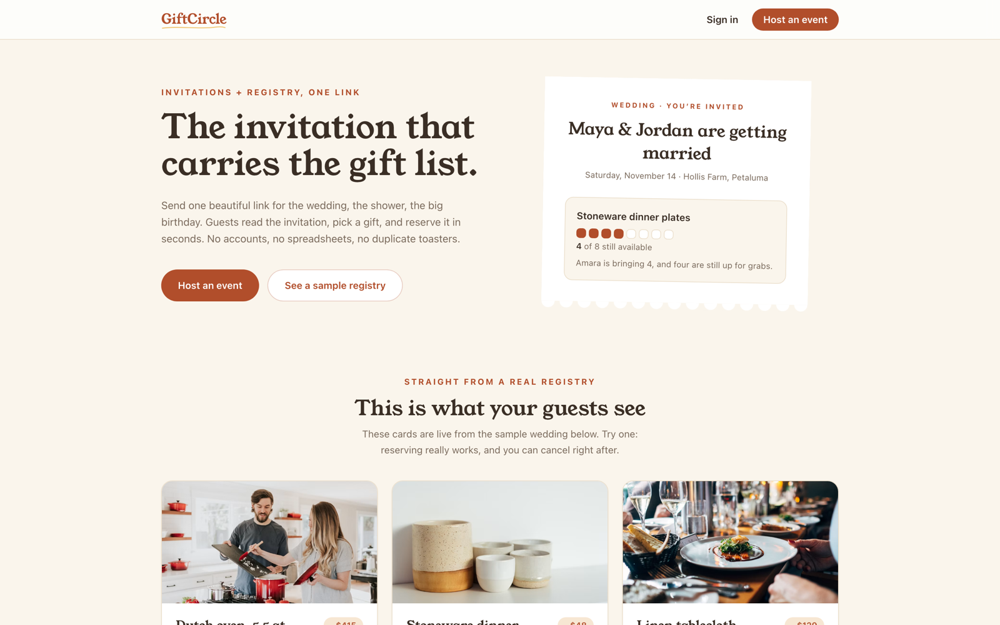
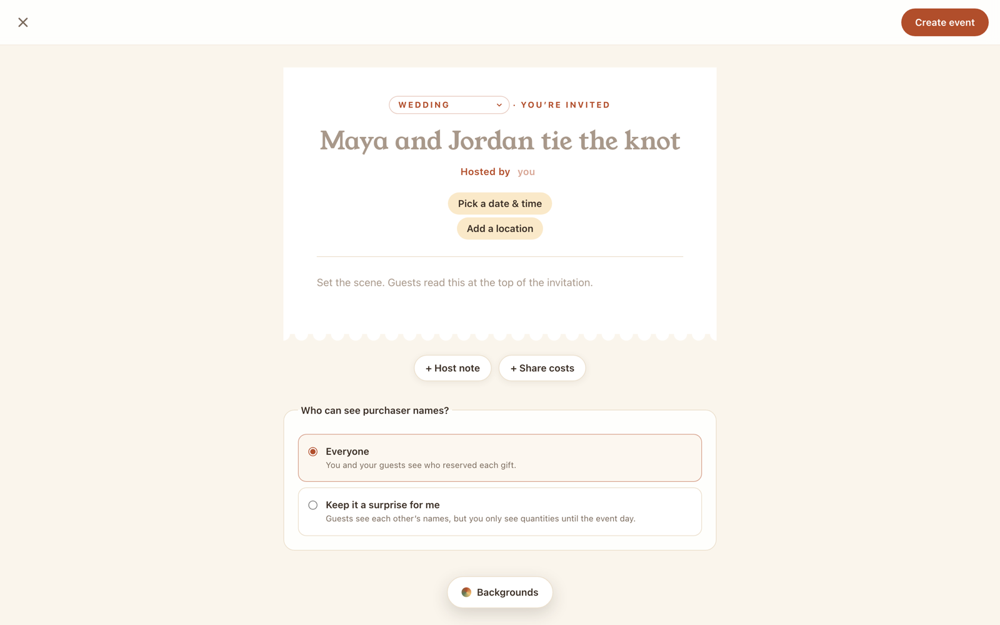
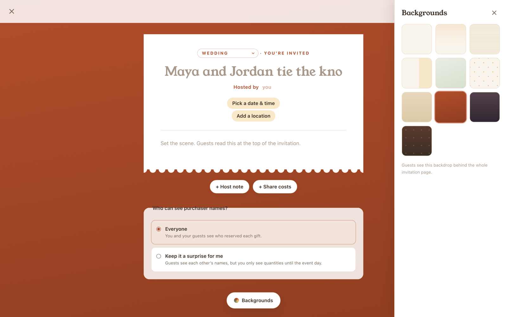
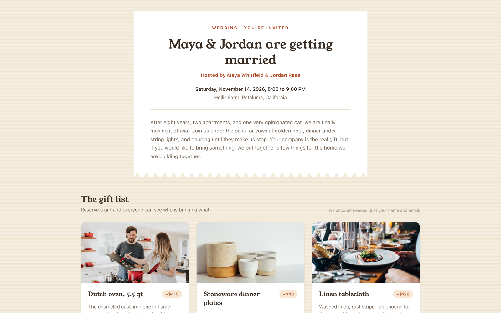

# GiftCircle

The invitation that carries the gift list. Hosts design an event invitation in place, add gifts, and share a single link. Guests open it, read the invitation, and reserve gifts in seconds with just a name and email. No guest accounts, no spreadsheets, no duplicate toasters.

**Live**: <https://giftcircle-green.vercel.app>



## The canvas editor

Creating an event means editing the invitation itself, not filling out a form. Click the title and type (the empty title cycles through example names, typewriter style), pick a date and time from a hand-built calendar, search for a location with autocomplete, and add optional sections: a host note, or a share-costs block with Venmo, Zelle, and Cash App handles.



Ten backdrop themes, all pure CSS in the site palette. Guests see the chosen backdrop behind the whole live invitation page.



## What guests see

One link per event: the invitation and the gift registry live together at `/e/[slug]`.



## Features

- **Account-free reservations**: guests identify with just a name and email and receive a private management link to change or cancel later.
- **Atomic inventory**: finite gifts can never be over-claimed. A row-locking PostgreSQL function serializes concurrent claims, and duplicate form submissions are idempotent (same token, same reservation).
- **Unlimited gifts**: "bring a bottle" style items accept any number of reservations, with punch-card quantity ticks on the gift cards.
- **Surprise mode**: in `surprise_host` visibility, guests see each other's names but the host sees only quantities until the event date. In `public` visibility, everyone sees purchaser names.
- **Privacy by construction**: guest emails are never displayed anywhere. Management tokens are stored only as SHA-256 hashes. The reservations table has RLS enabled with zero direct-access policies, so every read and write goes through sanitizing SQL functions.
- **Host accounts**: Supabase Auth with email and password, Google sign-in, and password reset.
- **Location search**: free-text autocomplete backed by Photon (OpenStreetMap), biased to the visitor's region, with typed house numbers preserved.

## Stack

Next.js (App Router), React, TypeScript, Tailwind CSS v4, Zod, Supabase (Postgres + Auth), Vitest, Playwright. Deployed on Vercel.

## Getting started

```bash
npm install
npm run dev
```

With no Supabase credentials configured, the app runs in **demo mode**: an in-memory store seeded with sample fixtures (resets on restart). This is intended for UI development and tests only.

- Sample public registry: <http://localhost:3000/e/maya-and-jordan>
- Sample surprise-mode registry: <http://localhost:3000/e/baby-whitfield-shower>
- Demo host sign-in: `demo@giftcircle.test` / `password123`
- Sample guest management links: `/reservation/seed-token-amara`, `/reservation/seed-token-ben`, `/reservation/seed-token-chloe`, `/reservation/seed-token-dev`

### Connecting Supabase

1. Create a Supabase project (or `supabase start` for the local stack).
2. Apply the schema and seed:
   ```bash
   supabase link --project-ref <your-ref>   # hosted project
   supabase db push                          # applies supabase/migrations
   # seed (local: `supabase db reset` runs it automatically; hosted: paste
   # supabase/seed.sql into the SQL editor, dev/staging only, it creates a
   # demo auth user)
   ```
3. Configure env vars:
   ```bash
   cp .env.example .env.local
   # fill in NEXT_PUBLIC_SUPABASE_URL and NEXT_PUBLIC_SUPABASE_PUBLISHABLE_KEY
   ```
4. `npm run dev` now uses Supabase for auth and data. Sign up at `/signup` (enable the Email provider in Supabase Auth settings; with email confirmation on, confirm before signing in).

### Deploying to Vercel

Push the repo, import it in Vercel, and set the two `NEXT_PUBLIC_SUPABASE_*` environment variables. Do not run the seed against production, and never expose the `service_role` secret key: the app only ever needs the publishable key.

## Verification

```bash
npm run verify     # lint + typecheck + unit tests + build
npm run test       # Vitest unit suite
npm run test:e2e   # Playwright, runs its own production build in demo mode
```

The unit suite covers availability math, visibility masking, validation, calendar math, date and time formatting, backgrounds, and geocoding. The two Playwright journeys walk the real flows end to end: a guest reserves, updates, and cancels a gift; a host signs in, creates an event in the canvas editor, and manages gifts and reservations.

## Architecture notes

- `src/lib/data/`: one `DataStore` interface, two implementations. `SupabaseStore` talks to Postgres through SQL functions and RLS; `MemoryStore` is a seeded in-memory mirror of the SQL semantics, used without credentials and in tests.
- `supabase/migrations/`: schema, indexes, RLS policies, and the SECURITY DEFINER functions (`create_reservation`, `update_reservation_by_token`, `cancel_reservation_by_token`, `get_event_registry`, `get_host_event_reservations`, `get_reservation_by_token`).
- Reservation atomicity: `create_reservation` takes `SELECT ... FOR UPDATE` on the gift row, re-checks claimed totals, then inserts, so concurrent claims serialize per gift.
- Visibility masking is implemented twice on purpose: in SQL for production reads, and in `src/lib/visibility.ts` for the memory store and unit tests.
- The invitation is one shared component (`InvitationCard`) rendered bare on the guest page and wrapped in editable slots by the canvas editor, so the preview can never drift from what guests see.

## Limitations

- No payments, retailer APIs, or email notifications yet.
- Demo mode data is per-process and non-persistent; not for production.
- Guests who lose their management link cannot recover it themselves (no email delivery yet); the host can remove the reservation.
